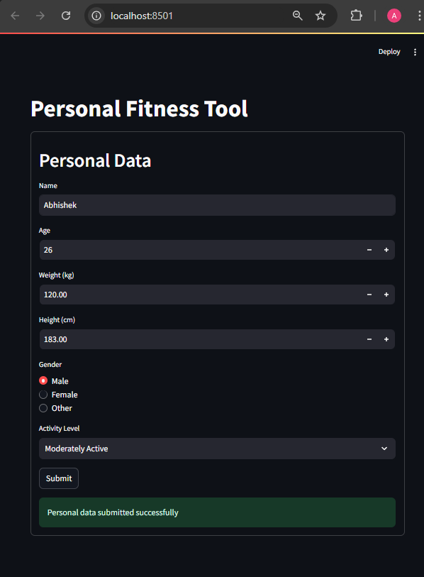

# Multi_Agent

- ### ADVANCED Python AI Multi-Agent Tutorial (RAG, Streamlit, Langflow & More!) - From TechWithTim YT

- Build an advanced multi-agent AI app through Python, Langflow, Astra DB, Streamlit, and more. This app will use multiple LLMs that to handle different tasks, routing those tasks to different LLMs, and will even have a full frontend that allows you to interact with the completed application.
- python for coding
- Streamlit for handling the front-end and interacting with our LLMs (Python UI library)
- LangFlow - low-code visual editor that allows us to build out advanced AI flows
- AstraDB for vector database as we're going to be implementing some retrieval augmented generation features inside of this app.

### Video Resources 🎞

- Get started with DataStax: https://dtsx.io/techwithtim-astradb
- Langflow Github Rep: https://dtsx.io/techwithtim-langflow
- Check out DataStax AI PaaS: https://dtsx.io/techwithtim-aipaas
- Code in this video (prompts/code/flows): https://github.com/techwithtim/Advanced-Multi-Agent-Workout-App
- Langflow is a low-code app builder for RAG and multi-agent AI applications. It’s Python-based and agnostic to any model, API, or database. - [github](https://github.com/langflow-ai/langflow)
- To get the google generative AI Api key - [resource](https://aistudio.google.com/app/apikey)
- To observe APi usage - [link](https://console.cloud.google.com/apis/dashboard)

### LangFlow Setup

- It is a low code editor for building AI applications & we can interact with langflow by running the flow locally or we can use an API that's hosted by langFLow , provided by datastax also provided astraDB - which is a vector capable database, which means we can actually perform the vector search operations.
- Go to https://www.langflow.org/ and create an account & click on build with langflow , click on New Flow ( AI Project) -> Blank FLow
- let's build a `Simple flow` -> That recommends the macros like the protiens the calories , the fat and the carbs based on a user's profile & give it a name = `Macro Flow` & endpoint name = `macros` -> endpoint is what you'll be calling when you want to use this flow , as all of these flows will actually be accesible via a public API & you need a token in order to use them
  - From our python code , we can just send a simple request to this `/macros` endpoint which will be hosted by LangFlow & we provide our token and start using it.
- A FLow always begins with some kind of input that can be a text input(coming from the api) or chat input(coming from chat window from the playground tab (where we can mess with out flows))
  - We start with Two Text Inputs - one is Goals & other is Profile
    - first thing i want to pass to my model is the various goals that we have ( like gain muscle or lose fat) so that we can recommend the different macros for this particular user.
    - second is how much do u weigh , what is your gender & what's your activity level - we need to know that in order to generate the correct macros
- Now we have our goals and profile info & next we need to do is we're going to funnel this into a prompt ( drag and drop and click on prompt window - where we can put in any prompt we want - to generate some result from the AI from LLM) - Inside of prompt if you want to have some kind of variables , some dynamic information , you can put those inside of curly braces - prompt Variables - something like {profile} , {goals} - looks something like this :
  
- now i have two new inputs to my prompt - goals and profile & just connect the goals & profile text inputs to prompt & now whatever i put into these inputs will be passed into this prompt templates as goals and profile variable & obviously we need to tell the prompt what to do - let's paste in the prompt available from the resources macro.txt

````
Based on the following user profile, please calculate the recommended daily intake of protein (in grams), calories, fat (in grams), and carbohydrates (in grams) to achieve their goals. Ensure that the response is in JSON format with no additional explanations or text.

User Profile: {profile}

Goals: {goals}

Output Format:
Return the result in JSON format only, with the keys: "protein", "calories", "fat", and "carbs". Each key should have a numerical value. Do not include any additional text or explanations, only the JSON object.

Output Format
    "protein": ,
    "calories": ,
    "fat": ,
    "carbs":

Notes:
Ensure you do not include ```json ``` in the response, simply give me a valid json string with no formatting or display options
````

- now next step is to pass this into a llm -> go to models - iam going to use google generative AI model & connect prompt to model input & provided my GOOGLE_API_KEY & model - gemini-1.5-pro
- next is to provide some output - we use a text output & overall flow looks like this :
  
- we can test this by running the play buttons & want to run it as a whole - go to playground - pass it info and run flow
  - Goals : fat loss , Profile : weight : 120kg , height: 183cm , gender:male - then run all the components
  - output : {"protein": 180, "calories": 2200, "fat": 60, "carbs": 150}
    

#### building a complex flow/Agent

- Build a new flow - ASK AI Flow - As usual as above create a new blank flow and give endpoint as ask-ai-v1
- In this we are going to have two different routes:
  - one route is answers questions based on the context , given the different notes that we have given the profile , it's going to answer the question
  - Another route is that allows you to have access to a calculator
- Bring in a Text Input - Question - users will ask some kind of question and thats needs to routed to answered by route 1 or route 2
- bring in a prompt - give it the description on what the llm needs or guide the llm of what it needs to be doing - conditional_router.txt

```
You are a decision-making assistant, and your task is to respond with either "Yes" or "No" only—nothing else.

Here is the input: {question}

If the user is requesting anything that involves math, respond with "Yes."
If the user is asking a general question or making a request that does not involve math, respond with "No."
Your responses should be limited to "Yes" or "No" without any additional details or explanations.
```

- here we are trying to use a llm to just give me a yes or no reply , if yes , call math calling agent or other agent - ROuting this request to go to the specific area where it can be handled best
- now connect this to a LLM to generate a yes or no - connect the prompt to llm INput - now connect the result of the LLM to a conditional_router(currently If-Else) - which kind of does what it says , it will route a response or some kind of message to a different output based on what the input is , take the output text of LLM and pass it as Input text to conditional_router
- In conditional_router , In match_text put Yes , here we match whatever generative AI is going to give , if it matches it goes to true route or false route
- And also we're going to pass the message(our user question) to the conditional_router to pass it along ( this isn't applicable for our Gemini model it takes care of this )
- Add a Tool calling agent - which will have access to various tools - it could be a python script or wikipedia API or could be a google search API or bunch of different tools - based on the input that we give it , it can utilize those tools , get a response from them and then inject that response or information or context in it's eventual reply
- connect the true route from conditional_router to the input of tool calling agent and now add tools - go to tools - bring in the calculator
- And we also have a Language model that needs to be passed to this tool calling agent - The agent here kind of works like a wrapper around a llm , where it gives the interface for the LLM to be able to utilize these tools
- Match the response of the tool calling agent to Text Output
- Also we need to provide system prompt on what the tool calling agent must be doing ( need to tell it more specifically what it should actually be doing , how it should be replying to the input we've passed)
- so we need to generate a prompt(prompt template) to be given to the system prompt of tool calling agent

```
You are a helpful assistant that can uses the tools provided to answer questions. You have access to a users profile and notes which you can use to assist in your answer.

The users profile is:
{profile}

Notes/facts are: {notes}
```


- Next add Text Input - profile
- Our Notes are going to be stored in an AstraDB database(a vector search database) , which means we can actually use kind of RAG component - retrieval augmented generation , which will allow us to grab relevant notes and inject those inside of our prompt
- Add a vector DB here it's provided by DataStax and vector database can store vectors (fixed-length lists of numbers) along with other data items & select embedding model - Astra Vectorize &
- these vector database allows machine learning to be used to power search , recommmendations , and text generation use-cases connect question text to astradb input\
- astra db gives json output and we use parse json component to parse it and convert it to plain text and pass it to prompt notes

#### running locally

- pip install langflow python-dotenv

### calling the flow from API

- we will call the Macro FLow using python API
- In Langflow -> Go to Macro Flow -> To API -> Python API -> Make some tweaks before copying the API code into our VS Code -> In Tweals -> Add goals and profile to the value field of those components & we can see following changes to our API code so that we can pass our own goals and profile inputs from our code

```
TWEAKS = {
  "TextInput-XXXX": {
    "input_value": "goals"
  },
  "TextInput-XXXX": {
    "input_value": "profile"
  },
}
```

- Now get our python API code into macro_flow_ai.py & make some modifications -> remove def main(): -> after code changes and run the file

```
$ python macro_flow_ai.py
{'session_id': 'a9a0c5bd-0c87-423b-9858-34afd0c8a17b', 'outputs': [{'inputs': {'input_value': ''}, 'outputs': [{'results': {'text': {'text_key': 'text', 'data': {'text': '{"protein": 176, "calories": 2200, "fat": 73, "carbs": 247}\n', 'files': [], 'timestamp': '2024-11-19 15:33:23 UTC', 'flow_id': 'a9a0c5bd-0c87-423b-9858-34afd0c8a17b'}, 'default_value': '', 'text': '{"protein": 176, "calories": 2200, "fat": 73, "carbs": 247}\n', 'sender': None, 'sender_name': None, 'files': [], 'session_id': '', 'timestamp': '2024-11-19T15:33:23Z', 'flow_id': 'a9a0c5bd-0c87-423b-9858-34afd0c8a17b', 'error': False, 'edit': False, 'properties': {'text_color': None, 'background_color': None, 'edited': False, 'source': {'id': None, 'display_name': None, 'source': None}, 'icon': None, 'allow_markdown': False, 'state': 'complete', 'targets': []}, 'category': 'message', 'content_blocks': []}}, 'artifacts': {'text': {'repr': '{"protein": 176, "calories": 2200, "fat": 73, "carbs": 247}\n', 'raw': '{"protein": 176, "calories": 2200, "fat": 73, "carbs": 247}\n', 'type': 'text'}}, 'outputs': {'text': {'message': '{"protein": 176, "calories": 2200, "fat": 73, "carbs": 247}\n', 'type': 'text'}}, 'logs': {'text': []}, 'messages': [{'message': '{"protein": 176, "calories": 2200, "fat": 73, "carbs": 247}\n\n', 'sender': 'Machine', 'sender_name': 'AI', 'session_id': '', 'component_id': 'TextOutput-tAUlo', 'files': [], 'type': 'text'}], 'component_display_name': 'Result', 'component_id': 'TextOutput-tAUlo', 'used_frozen_result': False}]}]}
```

---

```
return response.json()["outputs"][0]["outputs"][0]["results"]["text"]["data"]["text"]
$ python macro_flow_ai.py
{"protein": 176, "calories": 2200, "fat": 73, "carbs": 247}
```

## Build Frontend using streamlit

- streamlit is python UI library - pip install streamlit astrapy("allows us to interface with AstraDB to save data in the database and to automatically vectorize them")
- In the UI , we ask the user profile information & use the functions we just wrote to interact with those different flows that we built in LangFlow.
- main_ui.py for building the UI and db.py to handle operations for my database & form submit file form_submit.py file & also a profiles.py file
  

- Now save the data in Astra DB
- added env variables to connect to the astradb database and create collections that we deal with
  
- upto now we can see default profile values being showed up if there is not any profile in session_state
- Now we enter new values and submit them.
  
- even after refreshing the page we should see same info popping up again because now it's stored persistently in AstraDB
- we can see the personal data persisted in the collection
  
